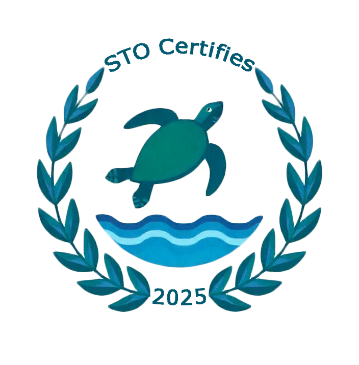
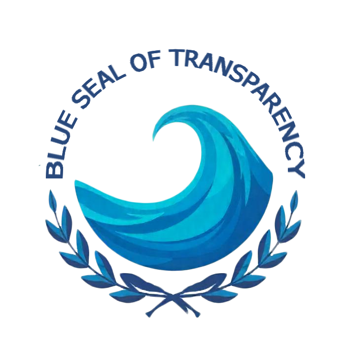

# The Sustainable Island 2025

A digital, Erasmus+ funded collaboration between WEB-Developer students from I.E.S. El Rincon, Las Palmas de Gran Canaria, Tækniskolinn, Reykjavik, Iceland and TECHCOLLEGE, Aalborg, Denmark.

<div align="center">
  <h2 align="center">Save the Ocean</h2>
  
</div>

Within the framework of United Nations Sustainable Development Goal 14, which aims to conserve and sustainably use the oceans, seas, and marine resources, our project proposes a digital platform for environmental transparency focused on reducing marine pollution.

Our application allows users to report marine pollution hotspots, identifying their location and the type of contaminant, with the option to attach images for better documentation. Additionally, companies can register on the platform to share data about their emissions and mitigation measures, enabling detailed tracking of their environmental impact and efforts to reduce it.

As an incentive for corporate responsibility, companies that voluntarily report their information and demonstrate an active commitment to reducing marine pollution will receive the "Blue Seal of Transparency", a certification that recognizes their collaboration and sound environmental practices.

By gathering and analyzing this data, the platform not only facilitates awareness and evidence-based decision-making but also encourages the adoption of more sustainable strategies within the industrial sector. Our goal is to create a transparent and accessible system that promotes citizen and corporate participation in the protection of our oceans.

<div align="center">
  
  
</div>

### Diagrams 📊

#### Class Diagram
<div style="text-align: center; height: fit-content; margin: 20px 0">
    
</div>

Directory Structure 📂

The directory structure in a project is crucial because it organizes the code in a clear and modular way, facilitating its maintenance and scalability. A good structure allows developers to quickly find and modify the necessary files, reduces the risk of errors, and improves team collaboration. Additionally, it promotes the adoption of good development practices, such as the separation of concerns and code reuse, making the project easier to understand, debug, and expand as it grows.

```
📦Backend
 ┣ 📂controllers
 ┣ 📂db
 ┣ 📂models
 ┣ 📂routes
📦Frontend
┣ 📂public
┣ 📂src
┃ ┣ 📂assets
┃ ┣ 📂components
┃ ┣ 📂services
```

#### Brief Explanation of the Directory Contents

**Backend**

* **controllers/**: Manages HTTP requests and responses.
* **db/**: Contains database-related files
* **models/**: Defines the data structure and interactions with the database.
* **routes**: Defines URL routing for the app.

**Frontend**

* **public/**: Contains static files.
* **src/**: Contains the source code of the React app.
  * **assets/**: Stores non-image assets like fonts or icons.
  * **components/**: Holds reusable UI components.
  * **services**/: Contains logic for interacting with external APIs.

## Getting Started 🚀

See Installation for instructions on how to deploy the project.

### Pre-requisitos 📋

* **[IDE]** - Integrated Development Environment. In our case, we used Visual Studio Code (https://code.visualstudio.com). It can be downloaded from the official website.
* **[Node]** -  A runtime environment that allows developers to run JavaScript on the server side. We can download it from the official website (https://nodejs.org/en/), it's recommended to use the LTS version.
* **[MySQL Server 8.0]** - Base de Datos. Lo descargaremos desde la web oficial (https://dev.mysql.com/downloads/installer/). IMPORTANTE: Durante la instalación
se nos pedirá crear la contraseña de administrador, es importante recordarla para su posterior uso.
* **[MySQL Workbench 8.0]** - Herramienta gráfica que permite a los usuarios diseñar, administrar y modelar bases de datos MySQL. Podemos descargarla desde la
web oficial (https://dev.mysql.com/downloads/workbench/).

### Installation 🔧

**In progress**

## Built With 🛠️

* [ReactJS] - ReactJS is an open-source JavaScript library used for building user interfaces, particularly single-page applications. It was developed by Facebook and focuses on creating reusable components that manage their own state and update efficiently. Its main feature is the use of a Virtual DOM (Document Object Model), which optimizes UI updates without needing to reload the entire page.
* [Node.js] - Execution environment that allows developers to run JavaScript on the server side.
* [Express.js] - Framework for web application development in Node.js.
* [Sequelize] - ORM (Object-Relational Mapping) for Node.js that allows interaction with SQL databases.
* [MySQL] - Tool for managing relational databases.

## Authors ✒️

* **Isaac Ramos** - *Initial Work* - [IsaacRamosDaw](https://github.com/IsaacRamosDaw)
* **Luke Hening** - *Initial Work* - [utlandingur](https://github.com/utlandingura)
* **Nicolas** - *Initial Work* - [Nipe15](https://github.com/Nipe15)
* **Echedey Henríquez** - *Initial Work* - [EchedeyHenr](https://github.com/EchedeyHenr)

## Acknowledgements

* [Tiburcio Cruz](https://github.com/tcrurav)
* [Heinz]
* [Jakub]
* [Smári]
* [emoji-cheat-sheet](https://github.com/ikatyang/emoji-cheat-sheet/blob/master/README.md#smileys--emotion)


## Licencia 📄

This project is licensed under the (Your License) - see the [LICENSE.md](LICENSE.md) file for details.

---
⌨️ with ❤️ by [IsaacRamosDaw](https://github.com/IsaacRamosDa), [utlandingur](https://github.com/utlandingura), [Nipe15](https://github.com/Nipe15), [EchedeyHenr](https://github.com/EchedeyHenr) 
